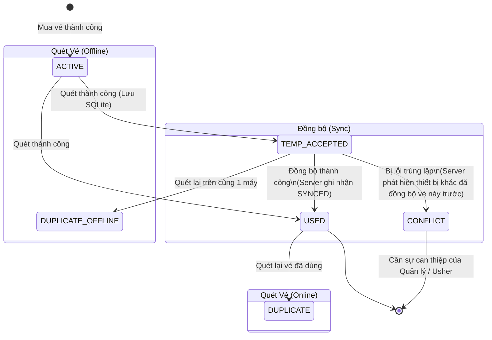
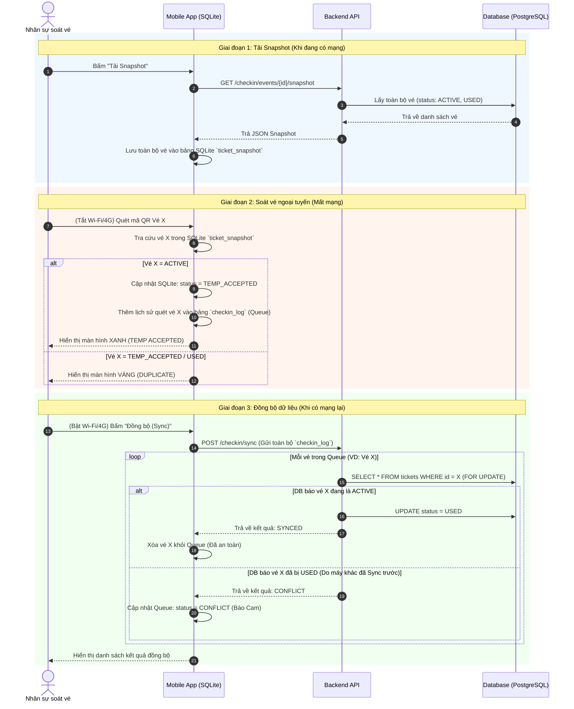

# BP07: Luồng soát vé mất mạng (Offline), Đồng bộ (Sync) & Xử lý Xung đột

Tài liệu này cung cấp các minh chứng thiết kế hệ thống (Blueprint) cho tiêu chí **BP07**, bao gồm Sơ đồ vòng đời trạng thái vé, Sơ đồ tuần tự mô tả luồng đồng bộ, và chiến lược xử lý xung đột.

---

## 1. Sơ đồ Trạng thái Vé (State Machine Diagram)

Sơ đồ dưới đây biểu diễn vòng đời của một chiếc vé từ khi được phát hành cho đến khi được quét tại cổng trong cả hai trường hợp: Có mạng (Online) và Mất mạng (Offline).

---

## 2. Sơ đồ Tuần tự (Sequence Diagram)

Sơ đồ tuần tự mô tả chi tiết quá trình từ lúc nhân viên tải dữ liệu về máy (Tải Snapshot), ngắt mạng để soát vé, và bật mạng lại để đồng bộ dữ liệu lên Server. Sơ đồ này cũng thể hiện rõ cách hệ thống chặn đứng lỗi "chi tiêu kép" (vé vào hai lần) khi 2 thiết bị cùng đồng bộ.

---

## 3. Chiến lược Xử lý Xung đột (Conflict Handling) & Tránh lọt người (Double-spend)

Khi áp dụng mô hình soát vé Offline bằng Snapshot cục bộ, rủi ro lớn nhất là bài toán **Chi tiêu kép (Double-spend)**: 2 người cầm 2 bản sao chép của cùng một mã QR và đưa cho 2 thiết bị quét Offline (đang bị cô lập mạng) khác nhau. Lúc này cả 2 máy đều đối chiếu SQLite và thấy vé hợp lệ, dẫn đến việc cả 2 máy đều báo XANH và cho 2 người vào cổng.

Hệ thống TicketBox giải quyết bài toán này thông qua kết hợp giữa thuật toán đồng bộ và nghiệp vụ:

### 3.1 Về mặt Thuật toán (First-to-Sync Wins)
- Các thiết bị soát vé được yêu cầu Đồng bộ (Sync) liên tục ngay khi có chập chờn mạng (hoặc dùng cron job ngầm định kỳ 30 giây).
- Khi Thiết bị A và Thiết bị B cùng đẩy lịch sử chứa vé X lên API `/checkin/sync`.
- Tại Database của Server, hàm check-in sử dụng **Row Locking (`FOR UPDATE`)** trong Transaction để xử lý tranh chấp:
  - Máy nào gọi API tới trước (VD: Máy A), Server đọc thấy vé X đang `ACTIVE`, sẽ đổi ngay sang `USED` và trả về **`SYNCED`** (Thành công).
  - Ngay tích tắc sau đó, Máy B gọi tới. Do Máy A đã khoá dòng chữ (lock) và đổi state thành `USED`, Máy B sẽ nhận được phản hồi vé đã bị trùng.
  - Server sẽ bắn tín hiệu **`CONFLICT`** về cho Máy B.
  - Ứng dụng trên Máy B thay vì xóa lịch sử, sẽ đổi màu thẻ vé đó trong Hàng đợi thành màu CAM (`CONFLICT`). Hệ thống lưu vết rõ ràng: *"Vào lúc 19:15, Thiết bị B đã cho một người xài vé giả lọt vào"*.
- **Kết quả:** Database của Server luôn đảm bảo tính toàn vẹn (Data Integrity) 100%, không bao giờ có 1 vé được ghi nhận Check-in 2 lần.

### 3.2 Về mặt Nghiệp vụ Sự kiện (Operations Mitigation)
Vì không phần mềm Offline nào chặn được lập tức tại cửa (do mất kết nối vật lý), hệ thống Mobile Checker cung cấp các tầng kiểm soát bổ sung:
1. **Kiểm tra theo Cổng (Gate Restriction):** Vé đi sai cổng sẽ bị app báo đỏ `WRONG_ZONE` ngay cả khi đang offline. Nếu 2 kẻ gian đi vào 2 cổng khác nhau sẽ bị chặn. Nếu đi cùng 1 cổng thì nhân viên sẽ dễ dàng nhận diện bằng mắt.
2. **Trạm Wi-Fi Nội bộ (Local LAN):** Với sự kiện lớn, BTC sử dụng bộ Router Wi-Fi nội bộ để các máy quét luôn kết nối mạng LAN với nhau, xóa bỏ hoàn toàn rủi ro bị delay mạng Internet.
3. **Chốt chặn số Ghế (Seat Conflict):** Khi 2 kẻ gian đi đến cùng 1 số ghế trong khán đài, tranh chấp sẽ xảy ra. Màn hình App luôn báo vị trí Ghế để nhân viên nội bộ (Usher) kiểm tra CMND/CCCD và mời người cầm vé giả ra ngoài. Lịch sử Audit Log `CONFLICT` lưu trên máy B lúc này sẽ là bằng chứng gian lận.
