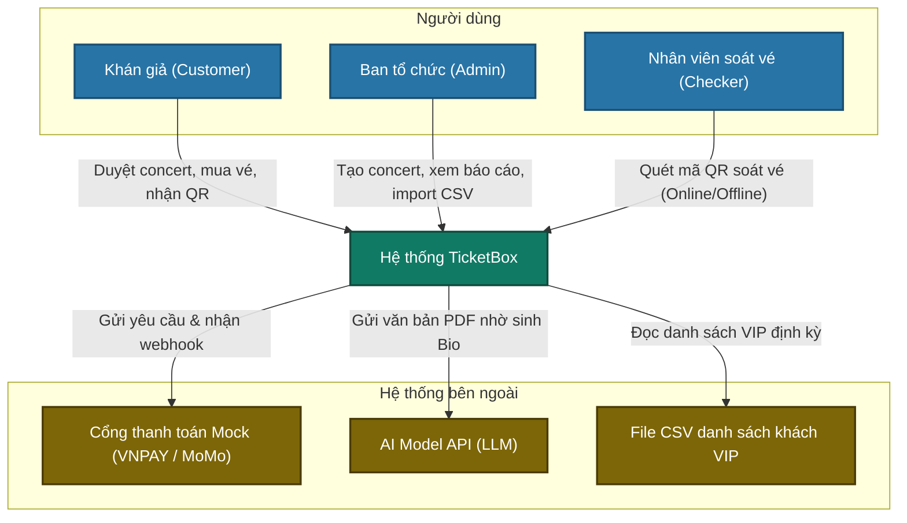
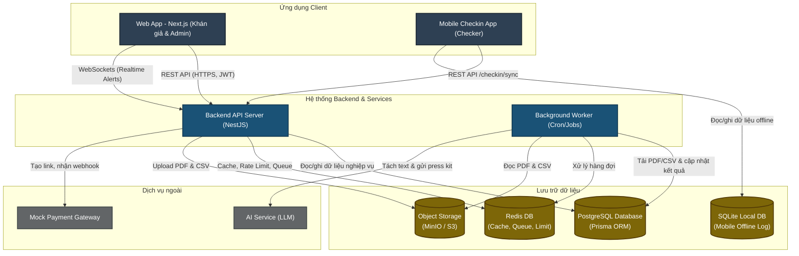
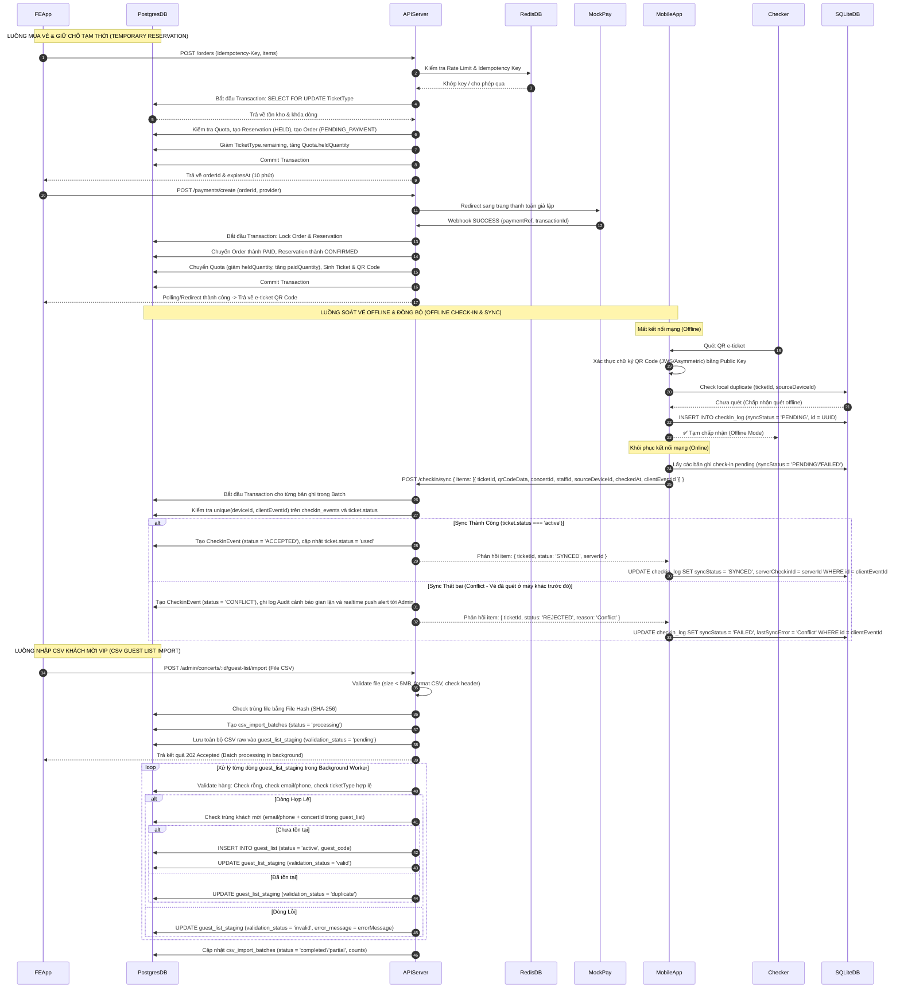

# TicketBox — Technical Design

Tài liệu này đặc tả chi tiết kiến trúc kỹ thuật của hệ thống **TicketBox**, các sơ đồ thiết kế hệ thống theo mô hình C4 (Level 1 & Level 2), các luồng dữ liệu quan trọng, thiết kế cơ sở dữ liệu, phân quyền kiểm soát truy cập (RBAC), và các giải pháp kỹ thuật giải quyết 7 bài toán hóc búa để bảo vệ hệ thống.

---

## Kiến trúc tổng thể
Hệ thống TicketBox được xây dựng theo kiến trúc **Monorepo** sử dụng công cụ quản lý Turborepo giúp chia sẻ kiểu dữ liệu và thư viện dùng chung dễ dàng. 

Hệ thống bao gồm các thành phần:
1.  **Frontend (Web App):** Viết bằng Next.js (App Router), đảm nhận toàn bộ giao diện cho Khán giả duyệt concert, đặt vé, thanh toán giả lập và hiển thị E-ticket QR Code; đồng thời cung cấp giao diện quản trị cho Admin quản lý concert và xem thống kê doanh thu.
2.  **Backend (API Server):** Viết bằng NestJS (TypeScript), xử lý toàn bộ logic nghiệp vụ, bảo vệ hệ thống (Idempotency, Rate Limiting, Waiting Room, Circuit Breaker) và giao tiếp cơ sở dữ liệu qua Prisma ORM.
3.  **Mobile App soát vé (Checkin App):** Chạy trên thiết bị di động của Checker, sử dụng SQLite local để lưu trữ log check-in tạm thời khi offline và đồng bộ hàng loạt (Bulk Sync) lên Backend khi có kết nối mạng.
4.  **Cơ sở dữ liệu:**
    *   **PostgreSQL:** Đóng vai trò là nguồn dữ liệu đúng cuối cùng (Single Source of Truth - SSOT), lưu trữ dữ liệu nghiệp vụ có tính nhất quán cao (Concerts, Orders, Tickets, Quotas...).
    *   **Redis:** Đóng vai trò làm lớp đệm cache thông tin concert, quản lý hàng đợi phòng chờ (Waiting Room), lưu trữ token rate limiting và bản ghi idempotency tạm thời.

---

## C4 Diagram

### Level 1 — System Context
Sơ đồ mô tả mối liên hệ giữa hệ thống TicketBox với người dùng và các dịch vụ bên ngoài:



---

### Level 2 — Container
Phân rã hệ thống TicketBox thành các container logic và các kênh giao tiếp:




---

## High-Level Architecture Diagram

Sơ đồ dưới đây biểu diễn chi tiết luồng dữ liệu của 3 nghiệp vụ quan trọng nhất trong hệ thống: **Mua vé**, **Soát vé offline & Đồng bộ**, và **Nhập CSV VIP**:



---

## Thiết kế cơ sở dữ liệu

Hệ thống TicketBox lựa chọn **PostgreSQL** làm cơ sở dữ liệu quan hệ chính do đặc trưng dữ liệu đặt vé yêu cầu tính nhất quán (ACID), tính toàn vẹn tham chiếu chặt chẽ và khả năng khóa bản ghi chống oversell tốt. 

### Các thực thể dữ liệu chính (Main Entities)
Ánh xạ từ tệp tin Prisma Schema của dự án:
*   **User:** Lưu trữ thông tin người dùng (Khán giả, Admin, Checker).
*   **Role & Permission (RBAC):** Mô hình phân quyền nhiều-nhiều (UserRole, RolePermission) để kiểm soát nghiêm ngặt quyền truy cập của từng đối tượng.
*   **Concert:** Thông tin sự kiện concert, địa điểm, thời gian và trạng thái (`DRAFT`, `PUBLISHED`, `CANCELLED`, `COMPLETED`).
*   **SeatZone:** Phân khu trên sơ đồ SVG tương tác (ví dụ khu GA, VIP, SVIP) gắn với Concert.
*   **TicketType:** Cấu hình loại vé của concert bao gồm: giá vé (`price`), tổng số lượng phát hành (`totalQuantity`), số vé còn lại (`remaining`), số vé tối đa một user được mua (`maxPerUser`), và khoảng thời gian mở bán.
*   **Reservation & ReservationItem:** Bản ghi lưu giữ vé tạm thời cho khán giả (trạng thái `HELD`, `CONFIRMED`, `EXPIRED`, `CANCELLED`) tự động giải phóng sau 10 phút nếu không thanh toán.
*   **UserTicketQuota:** Kiểm soát số vé user đang giữ tạm (`heldQuantity`) và số vé đã thanh toán (`paidQuantity`) của từng hạng vé để khống chế giới hạn mua.
*   **Order & OrderItem:** Đơn đặt vé của khách hàng (trạng thái `PENDING_PAYMENT`, `PAYMENT_PROCESSING`, `PAID`, `PAYMENT_FAILED`, `EXPIRED`...).
*   **PaymentEvent:** Lưu vết lịch sử webhook và transaction từ cổng thanh toán bên thứ ba (để đối soát và thực hiện idempotency).
*   **Ticket:** Vé điện tử chính thức được phát hành sau khi thanh toán thành công, chứa mã QR được ký số (`qrPayload`) và thông tin check-in thực tế.
*   **CheckinDevice & CheckinEvent:** Quản lý thiết bị soát vé của nhân viên và lịch sử check-in (mode `ONLINE` / `OFFLINE_SYNC`, kết quả `ACCEPTED`, `REJECTED`, `CONFLICT`).
*   **CsvImportBatch, GuestListStaging & GuestList:** Quản lý danh sách khách mời VIP được import từ file CSV.

### Ràng buộc và index quan trọng

- **`ticket_types`**
  - `CHECK (remaining >= 0)`
  - `CHECK (remaining <= total_quantity)`
  - `INDEX (concert_id, status)`

- **`user_ticket_quotas`**
  - `UNIQUE (user_id, ticket_type_id)`
  - `CHECK (held_quantity >= 0)`
  - `CHECK (paid_quantity >= 0)`

- **`orders`**
  - `INDEX (user_id, status)`
  - `INDEX (status, expires_at)` — phục vụ job quét order hết hạn

- **`payment_events`**
  - `UNIQUE (gateway, gateway_transaction_id, event_type)` — cốt lõi của idempotency webhook
  - `INDEX (payment_ref)`
  - `INDEX (created_at)`

- **`tickets`**
  - `UNIQUE (ticket_code)`
  - `INDEX (concert_id, status)`
  - `INDEX (order_id)`

- **`checkin_events`**
  - `UNIQUE (device_id, client_event_id)` — chống sync trùng lặp
  - `INDEX (ticket_id)`
  - `INDEX (concert_id, checked_at)`

- **`guest_list`**
  - `UNIQUE (concert_id, guest_code)`
  - `UNIQUE (concert_id, email)` WHERE email IS NOT NULL
  - `UNIQUE (concert_id, phone)` WHERE phone IS NOT NULL

---

## Thiết kế kiểm soát truy cập (RBAC)

TicketBox sử dụng mô hình RBAC đơn giản để kiểm soát quyền truy cập. Hệ thống có 3 vai trò chính:

1. `customer`: Khán giả.
2. `admin`: Ban tổ chức / quản trị viên nội bộ.
3. `checker`: Nhân sự soát vé.

Backend không tin tưởng frontend. Mọi request cần quyền đều phải đi qua `JwtAuthGuard` và `PermissionsGuard`.

Mô hình dữ liệu phân quyền:

- `User`: thông tin tài khoản.
- `Role`: vai trò, ví dụ `customer`, `admin`, `checker`.
- `Permission`: mã quyền, ví dụ `concert:read`, `order:create`.
- `UserRole`: bảng nối user với role.
- `RolePermission`: bảng nối role với permission.

Luồng kiểm tra quyền:

1. User đăng nhập và nhận JWT access token.
2. Request gửi lên backend với `Authorization: Bearer <token>`.
3. `JwtAuthGuard` xác thực token.
4. `PermissionsGuard` kiểm tra permission yêu cầu bởi endpoint.
5. Service tiếp tục kiểm tra business rule nếu cần, ví dụ customer chỉ được xem/hủy order của chính mình bằng ownership check trong service (so sánh `order.userId` với `request.user.id`).

### Quyền hạn chi tiết của các vai trò (Permissions Mapping)

*   **`customer` (Khán giả):**
    *   `concert:read`: Xem danh sách và chi tiết các concert đã phát hành.
    *   `order:create`: Đặt giữ vé tạm thời và tạo đơn hàng.
    *   `order:read_own`: Xem chi tiết đơn hàng của bản thân.
    *   `order:cancel_own`: Hủy đơn hàng chưa thanh toán của bản thân.
    *   `payment:create`: Yêu cầu tạo phiên thanh toán cho đơn hàng của mình.
    *   `payment:read_own`: Xem trạng thái thanh toán của bản thân.
    *   `ticket:read_own`: Xem danh sách vé điện tử của bản thân.
    *   `notification:read_own`: Xem danh sách thông báo gửi cho bản thân.

*   **`admin` (Ban tổ chức / Quản trị viên nội bộ):**
    *   `user:manage`: Quản lý tài khoản người dùng và gán role.
    *   `concert:read_admin`: Xem toàn bộ các concert kể cả bản nháp (`draft`).
    *   `concert:create`: Tạo concert mới.
    *   `concert:update`: Cập nhật thông tin concert.
    *   `concert:cancel`: Hủy concert.
    *   `ticket_type:manage`: Cấu hình giá vé, số lượng vé, quota cho concert.
    *   `order:read_admin`: Xem toàn bộ đơn hàng của hệ thống.
    *   `payment:read_admin`: Xem lịch sử giao dịch và đối soát thanh toán.
    *   `ticket:read_admin`: Xem toàn bộ vé đã phát hành.
    *   `revenue:read`: Xem báo cáo và thống kê doanh thu.
    *   `guest_import:manage`: Thực hiện import CSV danh sách khách mời VIP.
    *   `artist_bio:manage`: Upload PDF nghệ sĩ và trigger AI sinh bio.
    *   `checker:manage`: Quản lý tài khoản soát vé và thiết bị quét.
    *   `notification:manage`: Quản lý cấu hình gửi thông báo và template.
    *   `audit_log:read`: Xem lịch sử hành động quản trị hệ thống.

*   **`checker` (Nhân sự soát vé):**
    *   `ticket:verify`: Kiểm tra thông tin mã QR xem có hợp lệ hay không.
    *   `checkin:scan`: Ghi nhận sự kiện check-in trực tuyến.
    *   `checkin:sync`: Gửi dữ liệu check-in offline lên server để đồng bộ.
    *   `checkin:snapshot_read`: Tải snapshot dữ liệu vé để phục vụ soát vé offline.

---

## Thiết kế các cơ chế bảo vệ hệ thống

### 1. Kiểm soát tải đột biến (Traffic Spike Control)
Để tránh sập API Server và PostgreSQL khi 80.000 user truy cập trong phút đầu tiên mở bán:
*   **Rate Limiting (Token Bucket):** 
    *   Triển khai Token Bucket sử dụng Redis để lưu số lượng token còn lại và timestamp cập nhật của mỗi user/IP.
    *   Khi có request gửi đến `POST /orders`, Redis kiểm tra và nạp token tự động dựa trên thời gian trôi qua.
    *   *Ngưỡng:* Tối đa 5 requests tạo order/phút đối với mỗi User, và 60 requests/phút đối với mỗi IP. Vượt ngưỡng trả về `429 Too Many Requests`.
*   **Waiting Room (Phòng xếp hàng ảo):**
    *   Nếu số lượng request tạo order vượt quá ngưỡng chịu tải của database (ví dụ > 500 orders/giây), hệ thống tự động đưa các request mới vào một phòng chờ.
    *   Sử dụng Redis Sorted Set (`ZADD`) lưu token của user làm hàng đợi dựa trên timestamp.
    *   Khách hàng ở frontend sẽ nhận trạng thái xếp hàng và thực hiện polling định kỳ để biết vị trí của mình.
    *   Background worker sẽ duyệt và cấp phép (admit) cho một lượng user vừa đủ (ví dụ 100 user/giây) vào luồng checkout thực tế, đảm bảo database luôn hoạt động dưới ngưỡng an toàn.

### 2. Xử lý cổng thanh toán không ổn định (Circuit Breaker)
Để cô lập lỗi khi cổng thanh toán Mock VNPAY/MoMo bị gián đoạn:
*   **Circuit Breaker (Trình ngắt mạch):**
    *   Mỗi provider (VNPAY/MoMo) được giám sát bởi một Circuit Breaker lưu ở Redis (chia sẻ giữa các instance backend).
    *   *Trạng thái CLOSED:* Cổng thanh toán hoạt động bình thường. Mọi request `POST /payments/create` được gửi đi.
    *   *Trạng thái OPEN:* Nếu có 5 lỗi liên tiếp xảy ra khi gọi API của cổng thanh toán trong 1 phút, mạch tự động chuyển sang `OPEN`. Mọi request tạo thanh toán mới qua cổng này lập tức bị từ chối và trả về lỗi `503 Service Unavailable` mà không gọi ra ngoài. Giữ trạng thái này trong 60 giây.
    *   *Trạng thái HALF-OPEN:* Sau 60 giây, cho phép 3 request thử nghiệm đi qua. Nếu cả 3 thành công, chuyển mạch về `CLOSED`. Nếu bất kỳ request nào lỗi, quay lại trạng thái `OPEN`.
*   **Graceful Degradation (Suy thoái có kiểm soát):**
    *   Khi cổng VNPAY bị sập (OPEN), nút chọn thanh toán VNPAY trên giao diện Frontend sẽ bị mờ đi và thông báo bảo trì, nhưng khách hàng vẫn có thể chọn MoMo (nếu MoMo đang CLOSED) để tiếp tục mua vé.
    *   Tất cả các API phi thanh toán (xem concert, xem danh sách vé đã mua, check-in) hoàn toàn không bị ảnh hưởng.

### 3. Chống trừ tiền hai lần (Idempotency)
Đảm bảo an toàn giao dịch tuyệt đối cho `POST /orders` và `POST /payments/create`:
*   **Idempotency-Key:**
    *   Frontend sinh mã UUID duy nhất cho mỗi giao dịch mua vé và truyền trong header `Idempotency-Key`.
    *   Khi API nhận request, backend kiểm tra sự tồn tại của key trong Redis (cache tạm 15 phút) hoặc bảng `IdempotencyRecord` trong database.
    *   *Trường hợp 1 (Chưa tồn tại):* Backend tạo bản ghi `IdempotencyRecord` với trạng thái `PROCESSING`. Tiến hành xử lý logic nghiệp vụ. Khi hoàn tất, cập nhật trạng thái thành `COMPLETED` kèm response body và lưu lại.
    *   *Trường hợp 2 (Đang xử lý - PROCESSING):* Trả về HTTP `202 Accepted` hoặc `409 Conflict` yêu cầu client chờ đợi.
    *   *Trường hợp 3 (Đã hoàn tất - COMPLETED):* Trả về ngay response body đã lưu trước đó mà không thực thi lại nghiệp vụ (không trừ kho vé, không tạo order mới).
    *   *Trường hợp 4 (Đã tồn tại nhưng body request khác):* Trả về `409 Conflict` báo lỗi trùng lặp key nhưng sai dữ liệu.

*   **Giải quyết Race Condition giữa Webhook thanh toán và Job hết hạn đơn hàng (Webhook vs. Expire Job):**
    *   *Kịch bản:* Webhook từ cổng thanh toán báo thành công gửi về cùng thời điểm background job quét và hủy order quá hạn.
    *   *Giải pháp:* Cả tiến trình Webhook và Expire Job **bắt buộc phải thực hiện khóa dòng dữ liệu Order** (`SELECT * FROM orders WHERE id = $1 FOR UPDATE`) trước khi kiểm tra trạng thái và cập nhật.
    *   *Nếu Webhook lấy khóa trước:* Trạng thái order chuyển từ `PENDING_PAYMENT` sang `PAID`. Khi Expire Job có khóa sau đó, nó thấy trạng thái đã là `PAID` nên sẽ bỏ qua không xử lý hủy nữa.
    *   *Nếu Expire Job lấy khóa trước:* Trạng thái order chuyển sang `EXPIRED`, giải phóng tồn kho vé và quota. Khi Webhook có khóa sau đó, nó thấy trạng thái đã là `EXPIRED` -> Backend không phát hành vé tự động mà đổi trạng thái đơn hàng thành `REFUND_REQUIRED`, đồng thời ghi nhận log `PaymentEvent` để admin hoàn tiền thủ công.


### 4. Caching Strategy (Lớp đệm dữ liệu)
Giảm tải truy vấn cho PostgreSQL:
*   **Chiến lược Cache-Aside:**
    *   *Danh sách concert (`cache:concert:list`):* Cache kết quả danh sách concert đã publish. TTL: 60 giây.
    *   *Chi tiết concert (`cache:concert:{id}`):* Cache thông tin chi tiết của concert. TTL: 60 giây.
    *   *Danh sách loại vé (`cache:ticket-types:{concertId}`):* Cache thông tin các hạng vé đi kèm. TTL: 10 giây.
    *   *Số vé còn lại của từng hạng (`cache:ticket-type:{id}:remaining`):* TTL cực ngắn: 3-5 giây để phản ánh tương đối chính xác số lượng vé còn lại trên UI.
*   **Invalidation (Xóa cache chủ động):**
    *   Khi Admin cập nhật concert/loại vé: Xóa ngay các key cache concert tương ứng.
    *   Khi tạo Order thành công hoặc khi Order quá hạn bị giải phóng vé: Thực hiện xóa (`DEL`) key cache tồn kho vé (`cache:ticket-types:{concertId}` và `cache:ticket-type:{id}:remaining`) để bắt buộc request tiếp theo phải đọc trực tiếp từ database và nạp lại cache mới.
    *   *Ràng buộc thép:* Cache chỉ phục vụ hiển thị ở frontend. Quyết định kiểm tra tồn kho để bán vé bắt buộc phải truy vấn thẳng vào PostgreSQL dưới row lock, tuyệt đối không dùng giá trị trong Redis cache để quyết định bán vé.

### 5. Chống bán vượt số lượng (Oversell Prevention)
*   **Row-Level Locking:**
    *   Khi tạo order giữ chỗ, backend thực hiện câu lệnh SQL nguyên bản thông qua Prisma:
        ```sql
        SELECT * FROM ticket_types 
        WHERE id = $1 
        FOR UPDATE;
        ```
    *   Câu lệnh này sẽ lock bản ghi loại vé đó lại, các transaction khác muốn đọc hoặc cập nhật hạng vé này phải xếp hàng đợi transaction hiện tại commit hoặc rollback.
    *   Hệ thống kiểm tra tồn kho thực tế: `remaining >= requestedQuantity`. Nếu không đủ, ném ra lỗi `SoldOut` và rollback transaction. Nếu đủ, tiến hành trừ tồn kho: `remaining = remaining - requestedQuantity`.
*   **Deadlock Prevention (Tránh khóa chết):**
    *   Nếu khán giả đặt mua nhiều hạng vé khác nhau trong cùng một đơn hàng, backend bắt buộc phải sắp xếp các `ticketTypeId` theo thứ tự bảng chữ cái (`ORDER BY id ASC`) trước khi thực hiện khóa `FOR UPDATE`. Điều này đảm bảo tất cả các transaction song song đều khóa tài nguyên theo cùng một trình tự, loại bỏ hoàn toàn khả năng xảy ra vòng lặp khóa chết (deadlock).

### 6. Giới hạn vé per-user (Quota Enforcement)
*   **Bảng `UserTicketQuota`:**
    *   Lưu trữ quota của từng user đối với từng loại vé: `heldQuantity` (số lượng đang giữ tạm chờ thanh toán) và `paidQuantity` (số lượng đã mua thành công).
*   **Transaction Validation:**
    *   Trong cùng transaction khóa `TicketType`, backend khóa dòng `UserTicketQuota` của user cho loại vé tương ứng.
    *   *Deadlock Prevention:* Nếu mua nhiều hạng vé khác nhau, các dòng `UserTicketQuota` cũng phải được sắp xếp và khóa theo thứ tự `ticketTypeId` tăng dần (`ASC`) tương tự như khóa `TicketType`.
    *   *Giải quyết tranh chấp khi khởi tạo Quota mới (Safe Upsert Lock):* Dưới tải cao, nếu 2 transaction song song của cùng một user kiểm tra thấy bản ghi quota chưa tồn tại trong DB, cả hai sẽ cùng cố gắng thực hiện `INSERT`. Điều này dẫn đến lỗi trùng lặp khóa duy nhất (`Unique constraint violation`). Do PostgreSQL không cho phép dùng `FOR UPDATE` trực tiếp trên câu lệnh `INSERT ... RETURNING`, hệ thống sử dụng quy trình 2 bước an toàn:
        ```sql
        -- Bước 1: Thực hiện chèn mới bản ghi quota (nếu chưa có) và tránh lỗi trùng lặp bằng DO NOTHING
        INSERT INTO user_ticket_quotas (user_id, ticket_type_id, held_quantity, paid_quantity, updated_at)
        VALUES ($1, $2, 0, 0, NOW())
        ON CONFLICT (user_id, ticket_type_id)
        DO NOTHING;

        -- Bước 2: Thực hiện truy vấn SELECT FOR UPDATE để khóa dòng quota vừa tạo/có sẵn một cách an toàn
        SELECT * FROM user_ticket_quotas
        WHERE user_id = $1 AND ticket_type_id = $2
        FOR UPDATE;
        ```
        Quy trình này đảm bảo bản ghi quota luôn được khởi tạo an toàn và áp dụng Row-Level Lock (`FOR UPDATE`) lên nó một cách nguyên tử mà không gây lỗi tranh chấp khóa.
    *   Kiểm tra: `heldQuantity + paidQuantity + requestedQuantity > maxPerUser`. Nếu vượt quá giới hạn, ném ra lỗi `TicketLimitExceeded` và rollback transaction.
    *   Nếu hợp lệ, tăng `heldQuantity` tương ứng với số lượng vé đặt mua.
    *   *Khi thanh toán thành công:* Trong transaction xử lý webhook, thực hiện giảm `heldQuantity` và tăng `paidQuantity`.
    *   *Khi đơn hàng hết hạn/thất bại:* Giảm `heldQuantity` và cộng trả lại tồn kho `TicketType.remaining`.

### 7. Soát vé offline và đồng bộ (Offline Check-in & Sync)
*   **Xác thực offline tại Client (Mobile App):**
    *   Khi có mạng, thiết bị soát vé gọi API tải snapshot dữ liệu vé hợp lệ của concert về lưu vào SQLite local. Đồng thời tải Public Key của hệ thống.
    *   QR code trên e-ticket thực chất là một chuỗi ký số chứa: `ticketId`, `ticketCode`, `concertId`, `ticketTypeId` và thời gian hết hạn (`exp`), được backend ký bằng Private Key (sử dụng thuật toán mã hóa bất đối xứng như RS256 hoặc ES256) khi xuất vé.
    *   Khi quét offline: App verify chữ ký của QR Code bằng Public Key để phát hiện vé giả mạo mà không cần gọi API (và không lo bị lộ khóa Private Key như khi dùng mã hóa đối xứng).
    *   Kiểm tra trạng thái quét trong SQLite local: `SELECT * FROM checkin_log WHERE ticketId = ?`. Nếu đã có bản ghi -> Cảnh báo vé đã quét. Nếu chưa, tiến hành ghi nhận check-in tạm thời: `INSERT INTO checkin_log` với trạng thái `syncStatus = 'PENDING'`, `id` tự sinh bằng UUID v4, và thời gian quét `checkedAt`.
*   **Đồng bộ Bulk Sync & Xử lý Conflict trên Server:**
    *   Khi thiết bị khôi phục kết nối mạng, app tự động lấy toàn bộ log check-in ở trạng thái `PENDING` và gọi API `/checkin/sync` gửi mảng check-in lên server.
    *   Server mở transaction, xử lý từng sự kiện check-in gửi lên:
        *   Duyệt tính duy nhất để tránh gửi trùng lặp nhờ constraint `unique(deviceId, client_event_id)` trên bảng `CheckinEvent`.
        *   Truy vấn trạng thái vé trong PostgreSQL:
            *   Nếu `ticket.status === 'active'`: Cập nhật trạng thái vé thành `used`, cập nhật `scannedAt` và tạo bản ghi `CheckinEvent` với kết quả `ACCEPTED`. Trả về client trạng thái `SYNCED`.
            *   Nếu `ticket.status === 'used'` (Vé đã bị quét trước đó ở một thiết bị khác trực tuyến hoặc đã sync trước): Server từ chối bản ghi check-in này, tạo `CheckinEvent` với kết quả `CONFLICT` kèm lý do lỗi, đồng thời ghi log Audit cảnh báo gian lận. Trả về client trạng thái `CONFLICT` để checker biết và xử lý.
        *   Client nhận phản hồi cập nhật trạng thái log local tương ứng (`SYNCED` hoặc `FAILED` kèm lý do lỗi).
*   **Xử lý Cảnh báo Conflict muộn (Late Conflict Resolution):**
    *   Do tính chất check-in offline, hệ thống không thể ngăn chặn hoàn toàn việc một vé QR giả/trùng lặp được quét thành công ở hai thiết bị offline khác nhau tại thời điểm mất mạng.
    *   Khi thiết bị thực hiện sync dữ liệu và server phát hiện ra trạng thái `CONFLICT`, hệ thống sẽ kích hoạt một sự kiện bất đồng bộ gửi thông báo Realtime (qua WebSockets) đến bảng điều khiển của Admin (Admin Dashboard).
    *   Thông báo hiển thị chi tiết: mã vé, thông tin khách hàng, ID thiết bị quét A (được chấp nhận), ID thiết bị quét B (báo conflict), và vị trí cửa soát vé (Gate Name). Từ đó, đội an ninh sự kiện có thể tiếp cận ngay cổng quét B để xử lý thực tế với khách hàng sở hữu vé quét sau.


---

## Các quyết định kỹ thuật quan trọng (ADR)

### 1. Cơ sở dữ liệu: PostgreSQL kết hợp Redis và SQLite
*   **Quyết định:** Sử dụng PostgreSQL cho dữ liệu nghiệp vụ chính, Redis cho caching/rate limit/waiting room queue, và SQLite cho Mobile App soát vé offline.
*   **Lý do:** Dữ liệu bán vé concert đòi hỏi tính toàn vẹn dữ liệu cực kỳ cao (ACID) để tránh oversell, do đó cơ sở dữ liệu quan hệ như PostgreSQL là lựa chọn tối ưu nhờ hỗ trợ row-level locking và transaction mạnh mẽ. Redis cung cấp tốc độ đọc/ghi bộ nhớ cực nhanh để làm giảm tải cho PostgreSQL ở các tính năng đọc nhiều hoặc các nghiệp vụ cần tốc độ phản hồi tính bằng mili-giây (Rate Limiting). SQLite là hệ quản trị cơ sở dữ liệu nhúng nhẹ nhất, không cần cài đặt server, lưu trữ trực tiếp dưới dạng tệp tin trên thiết bị di động, hoàn hảo cho việc lưu trữ offline log trên Mobile App.

### 2. Quản lý trạng thái khóa: Pessimistic Locking (Khóa bi quan) thay vì Optimistic Locking (Khóa lạc quan)
*   **Quyết định:** Sử dụng `SELECT ... FOR UPDATE` (Pessimistic Locking) trong PostgreSQL khi thực hiện đặt vé và quota check.
*   **Lý do:** Đối với các sự kiện concert cực hot, tỷ lệ tranh chấp vé ở giây đầu mở bán là cực kỳ lớn (hàng nghìn người cùng mua 1 block vé). Nếu dùng Optimistic Locking (dựa trên version/timestamp), số lượng transaction bị rollback do xung đột phiên bản sẽ rất cao, gây lãng phí tài nguyên CPU của server và mang lại trải nghiệm tệ cho người dùng khi liên tục bị báo lỗi thử lại. Pessimistic locking bắt các transaction xếp hàng chờ đợi một cách trật tự, đảm bảo khi một transaction được duyệt qua, nó chắc chắn thực hiện thành công việc giảm tồn kho mà không lo ngại xung đột ghi.

### 3. Phương pháp truyền thông tin Webhook: Idempotency bằng database record thay vì chỉ dùng Redis
*   **Quyết định:** Lưu vết trạng thái xử lý các transaction và webhook thanh toán thông qua bảng dữ liệu `IdempotencyRecord` trong PostgreSQL thay vì chỉ lưu key tạm thời trong Redis.
*   **Lý do:** Mặc dù Redis có tốc độ cao, nhưng dữ liệu trong Redis có thể bị mất khi server khởi động lại hoặc bị tràn bộ nhớ (eviction). Sự cố mất dữ liệu idempotency có thể dẫn đến việc webhook thanh toán của ngân hàng gửi lại bị xử lý lần hai, gây thất thoát tài chính lớn (sinh thêm vé vô tội vạ). Việc lưu vết lâu dài (24 giờ đến 30 ngày) trong PostgreSQL đảm bảo an toàn tuyệt đối cho mọi giao dịch thanh toán.
