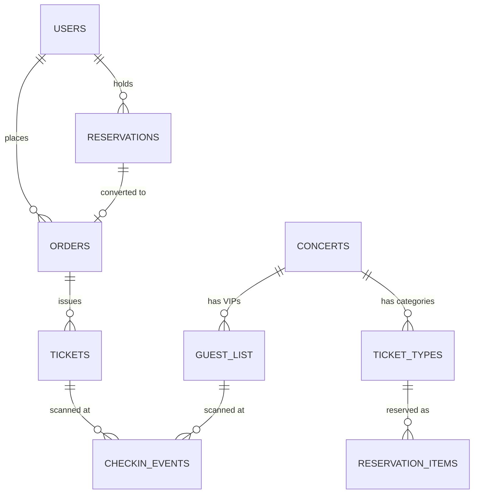

# 4. Thiết kế cơ sở dữ liệu

## 4.1. Xác định các loại dữ liệu chính trong hệ thống

Hệ thống TicketBox phục vụ nghiệp vụ phân phối vé sự kiện và kiểm soát vào cổng, do đó dữ liệu được chia thành các nhóm có đặc tính khác nhau:

1. **Dữ liệu giao dịch (Transactional Data):**
   - **Bao gồm:** Thông tin người dùng (User), Đơn hàng (Order), Giữ chỗ (Reservation), Sự kiện (Concert), Vé đã phát hành (Ticket), và Hàng tồn kho (Quota/Ticket Type).
   - **Đặc tính:** Có cấu trúc cố định, quan hệ ràng buộc chặt chẽ với nhau (ví dụ: Vé phải thuộc về một Đơn hàng và một Sự kiện). Đòi hỏi tính nhất quán tuyệt đối (ACID) để tránh tình trạng bán vượt quá số lượng (overbooking) hoặc sai lệch tài chính.

2. **Dữ liệu tạm thời & Truy xuất nhanh (Ephemeral & Fast-access Data):**
   - **Bao gồm:** Bộ nhớ đệm (Cache), giới hạn tần suất truy cập (Rate Limiting), khóa chống trùng lặp (Idempotency Key), và hàng đợi phòng chờ ảo (Waiting Room).
   - **Đặc tính:** Thay đổi liên tục với tần suất cực cao, có thời gian sống (TTL - Time to Live) ngắn hạn. Cần tốc độ đọc/ghi độ trễ cực thấp (microsecond).

3. **Dữ liệu bán cấu trúc (Semi-structured Data):**
   - **Bao gồm:** Payload Webhook trả về từ các cổng thanh toán (VNPAY, MoMo), dữ liệu JSON lưu trữ tạm thời cho quá trình tạo Bio nghệ sĩ bằng AI.
   - **Đặc tính:** Định dạng có thể thay đổi tùy thuộc vào đối tác bên thứ 3, không cố định bảng schema.

4. **Dữ liệu Log & Offline (Event / Log Data):**
   - **Bao gồm:** Lịch sử kiểm soát vé (Check-in Events), nhật ký đồng bộ (Sync Logs).
   - **Đặc tính:** Ghi tuần tự, số lượng lớn, ít bị chỉnh sửa. Tại thiết bị di động của nhân viên soát vé, dữ liệu này cần lưu trữ cục bộ khi mất mạng và đồng bộ về máy chủ khi có mạng.

---

## 4.2. Đề xuất loại Database phù hợp

Dựa trên đặc tính dữ liệu phân tích ở trên, dự án áp dụng kiến trúc **Kết hợp (Hybrid Database)**:

### 1. PostgreSQL (Relational Database / SQL) - **Cơ sở dữ liệu chính (Primary DB)**
- **Lý do lựa chọn:**
  - Đảm bảo tính **ACID** (Atomicity, Consistency, Isolation, Durability) vô cùng quan trọng cho các luồng giữ vé (Reservation) và thanh toán (Payment).
  - Khả năng khóa dòng (Row-level locking) mạnh mẽ để xử lý concurrency khi nhiều user cùng mua một loại vé.
  - Hỗ trợ tốt kiểu dữ liệu `JSONB` cho phép lưu trữ an toàn các payload linh hoạt từ cổng thanh toán bên thứ ba mà không cần dùng NoSQL riêng biệt.
- **Ứng dụng:** Lưu trữ toàn bộ dữ liệu nghiệp vụ: Users, Concerts, Orders, Tickets, Guest Lists...

### 2. Redis (In-memory Data Store / NoSQL) - **Bộ đệm và Trạng thái nhanh**
- **Lý do lựa chọn:**
  - Hoạt động hoàn toàn trên RAM (In-memory), cho tốc độ xử lý I/O vượt trội.
  - Hỗ trợ các cấu trúc dữ liệu tối ưu và thao tác Atomic (nguyên tử), rất phù hợp để làm các bộ đếm (counters) và khóa phân tán (distributed locks).
- **Ứng dụng:** Quản lý Rate Limiting (thuật toán Token Bucket), Idempotency Keys (tránh thanh toán trùng), và Caching thông tin vé/sự kiện.

### 3. SQLite (Local SQL) - **Cơ sở dữ liệu cục bộ (Mobile Client)**
- **Lý do lựa chọn:**
  - Gọn nhẹ, tích hợp sẵn vào ứng dụng Mobile.
  - Hỗ trợ truy vấn SQL tiêu chuẩn, cho phép lưu trữ và tìm kiếm Offline cực nhanh cho hàng ngàn bản ghi (Guest List, Ticket Snapshot).
- **Ứng dụng:** Lưu trữ `checkin_log` offline trên thiết bị Checker, lưu cache mã Public Key (RSA) để xác thực chữ ký vé mã hóa mà không cần kết nối internet.

---

## 4.3. Thiết kế schema cho các entity quan trọng nhất

Hệ thống được thiết kế theo hướng chuẩn hóa (Normalization) để tránh dư thừa dữ liệu, với các domain chính yếu như sau:

### 1. Domain: Users & RBAC (Phân quyền)
- **`users`**: Lưu thông tin người dùng (`id`, `email`, `password`, `status`).
- **`roles` / `permissions` / `user_roles`**: Thiết kế Role-Based Access Control. Người dùng có thể là `customer` (mua vé), `checker` (soát vé), hoặc `admin`.

### 2. Domain: Concerts & Inventory (Sự kiện và Kho vé)
- **`concerts`**: Quản lý sự kiện (`id`, `name`, `event_date`, `venue_name`, `status`).
- **`ticket_types`**: Các hạng vé của sự kiện (`id`, `concert_id`, `name`, `price`, `total_quantity`, `remaining`, `max_per_user`). Entity này đóng vai trò là "Kho hàng".

### 3. Domain: Order & Reservation (Giữ chỗ và Đơn hàng)
- **`reservations`**: Phiên giữ chỗ (`id`, `user_id`, `concert_id`, `status: HELD/CONFIRMED/EXPIRED`, `expires_at`). Giúp khóa vé tạm thời trong 15 phút thanh toán.
- **`orders`**: Hóa đơn mua vé (`id`, `reservation_id`, `total_amount`, `status`, `payment_method`, `idempotency_key`). Có quan hệ 1-1 với Reservation.
- **`payment_events`**: Bảng ghi nhận webhook phản hồi từ VNPAY/MoMo chứa `raw_payload` dạng JSON.

### 4. Domain: Ticket & Check-in (Vé điện tử & Soát vé)
- **`tickets`**: Vé vật lý/điện tử được cấp sau khi thanh toán thành công (`id`, `ticket_code`, `qr_payload`, `status: ACTIVE/USED`).
- **`guest_list`**: Danh sách khách mời VIP import từ CSV (`id`, `guest_code`, `concert_id`, `status`). 
- **`checkin_events`**: Ghi nhận lịch sử vào cổng (`id`, `ticket_id`, `guest_id`, `device_id`, `result: ACCEPTED/REJECTED/DUPLICATE`).

### Mô hình quan hệ cốt lõi (Core ERD logic)

